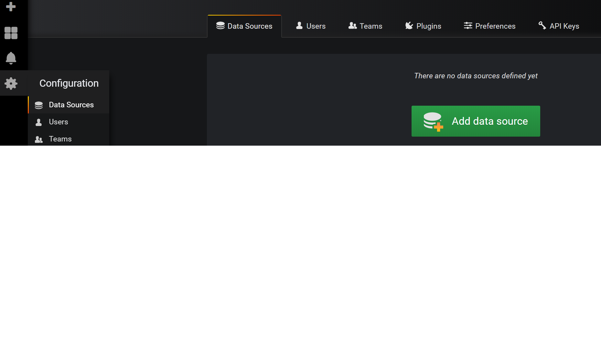

# Spark Performance Monitoring With Grafana and Log Analytics

## Deployment of Log Analytics With Spark Metrics

### Step 1: Deploy Log Analytics With Spark Metrics
1. Open project located at spark-monitoring\performance\deployment\loganalytics\LogAnalyticsResource\LogAnalyticsResource.sln, right click on the project Log Analytics Resource then select **deploy**.
click on Edit Parameters and enter **service tier, retention and location**. Click **deploy**.

## Deployment of Grafana

### Step 1: Deploy Certified Grafana From Azure
For Grafana deployment a bitnami certified image will be used. You can find more information about bitnami applications on azure at https://docs.bitnami.com/azure/get-started-marketplace/


1. Open project located at spark-monitoring\performance\deployment\
grafana\
GrafanaResource\GrafanaResource.sln, right click on the project **Grafana Resource** then select **deploy**.
2. click on  **Edit Parameters** and enter the admin password for the linux VM on **adminPass** parameter. Click **deploy**.

After the ARM template deploys the bitnami image of grafana a temporary grafana password for user admin will be created. To find those credentials follow bellow instructions.

3. Find the credentials for grafana by following instruction on https://docs.bitnami.com/azure/faq/get-started/find-credentials/

### Step 2: Change Grafana Administrator Password
1. Open the browser at http://grafanapublicipaddress:3000 and login in as admin and password from previous step
2. Move the mouse on the settings icon located to the left then click on **Server Admin**

3. Click on admin then on the text box **Change Password** enter new password the click **Update**

### Step 3: Create Service Principal for Azure Monitor Data Source Using Azure Cli

1. Enter command below to login to azure

```
az login
 ```
2. Make sure you are on the right subscription. You can set the default subscription with command below:
```
az account show
az account set --subscription yourSubscriptionId
```
3. Create the Service Principal running below command.


```
az ad sp create-for-rbac --name http://NameOfSp --role "Log Analytics Reader"
```
4. Take note of appId, password and tenant

```
{
  "appId": "applicationClientId",
  "displayName": "applicationName",
  "name": "http://applicationName",
  "password": "applicationSecret",
  "tenant": "TenantId"
}
```

### Step 4: Create Azure Monitor Datasource in Grafana


1. On grafana move mouse on the settings icon located to the left then click on **Data Sources** then **Add data Source**. Select **Azure Monitor**.


2. Enter **ALA** in name, SubscriptionId, TenantId(tenant in previous step), Client id(appId in previous step), Client secret (password in previous step). Click on check box **Same Details as Azure Monitor api** then click on **Save & test**


### Step 5: Import Spark Metrics Dashboard

1. Open a bash shell command prompt, move to the directory containing sparkMetricsDashboard.json file and execute commands below, replacing YOUR_WORKSPACEID with the workspace id of Log Analytics and SparkListenerEvent_CL with the log type if a non default logtype is used for spark monitoring.
The workspace id for Log Analytics can be found at the **advanced settings** blade of Log Analytics resource.


```
export WORKSPACE=YOUR_WORKSPACEID
export LOGTYPE=SparkListenerEvent_CL

sed  "/workspace/c\   \t\t\t\"workspace\" : \"${WORKSPACE}\"" "sparkMetricsDashboard.json"  | sed  "s/SparkListenerEvent_CL/${LOGTYPE}/g"    > sparkMetricsImport.json
```

or execute below script from same directory location

```
export WORKSPACE=YOUR_WORKSPACEID
export LOGTYPE=SparkListenerEvent_CL

sh DashGen.sh
```

2. On grafana move mouse on the settings icon located to the left then click on **Manage** then **Import**, browse to directory /spark-monitoring/performance/dashboards/grafana click on  open SparkMonitoringDash.json. Then select your azure monitor data source that was create before

